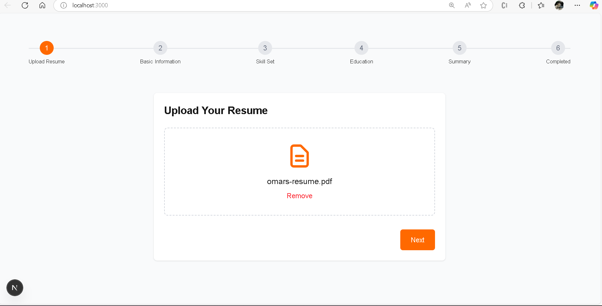
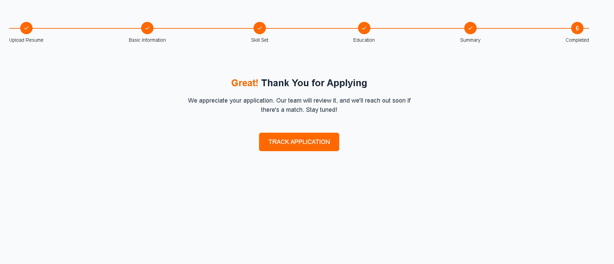

# 📝 Multi-Step Resume Application Form

A modern, responsive multi-step application form for candidates to upload their resume, enter personal details, add and reorder skills, education, and review everything before submitting. Built with React, Tailwind CSS, and react-beautiful-dnd, following best UX practices and a clean, professional design.



---

## ✨ Features

- **Multi-Step Navigation**  
  Progress indicator with clear steps: Upload Resume, Basic Information, Skill Set, Education, Summary, Completed.

- **Resume Upload**  
  Upload your PDF resume with drag-and-drop or file picker. Download your file from the summary page.

- **Personal Details**  
  Collects name, email, and phone with robust validation.

- **Dynamic Skills Management**  
  Add, remove, and reorder skills with drag-and-drop. Each skill includes a name and experience level.

- **Education Entries**  
  Add multiple education records, each with degree, institution, and year.

- **Summary & Confirmation**  
  Review all entered data, download your resume, agree to terms, and confirm your application.
  (./public/summary.png)

- **Persistence**  
  Your progress is automatically saved in your browser. Resume where you left off, even after a refresh.

- **Responsive & Accessible**  
  Looks great on all devices and is keyboard-friendly.

---

## 🚀 Quick Start

1. **Clone the repository**
   ```
   git clone https://github.com/bhargavi35/multi-step-form.git
   cd multi-step-form
   ```

2. **Install dependencies**
   ```
   npm install
   ```

3. **Run the development server**
   ```
   npm run dev
   ```

4. Open [http://localhost:3000](http://localhost:3000) in your browser.

---

## 📸 Screenshots

| Progress Stepper & Completion |
|------------------------------|
|  |

---

## 🛠️ Tech Stack

- [React](https://react.dev/)
- [Next.js](https://nextjs.org/) (if using Next.js)
- [Tailwind CSS](https://tailwindcss.com/)
- [react-beautiful-dnd](https://github.com/atlassian/react-beautiful-dnd)
- [Formik](https://formik.org/) + [Yup](https://github.com/jquense/yup) for forms and validation

---

**Made with ❤️ by Bhargavi Chella**
```
